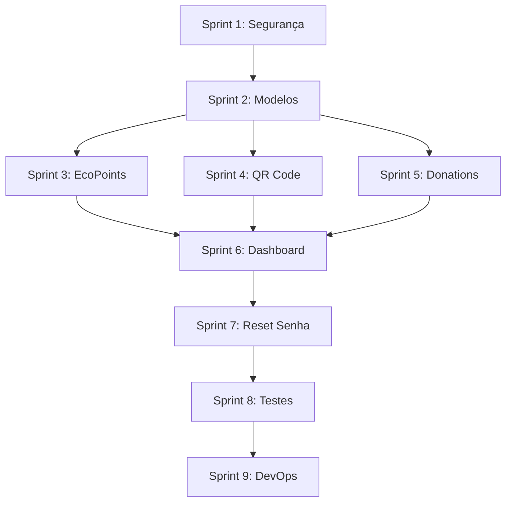

# 📋 **RELATÓRIO FINAL: Ecolink Backend - Estado Atual e Roadmap Completo**

## **SUMÁRIO EXECUTIVO**

### **Visão Geral do Projeto**

O **Ecolink Backend** é a API REST que suporta uma plataforma de reciclagem inteligente, conectando usuários, EcoPoints (estações de coleta) e cooperativas de catadores. O sistema visa incentivar a reciclagem através de gamificação, educação ambiental e rastreamento de impacto.

### **Status Atual do Projeto**

```
╔══════════════════════════════════════════════════════════════╗
║                 MATURIDADE DO SISTEMA: 42%                   ║
╠══════════════════════════════════════════════════════════════╣
║  ✅ IMPLEMENTADO                          42%                ║
║  ⚠️  PRECISA REFATORAÇÃO                   35%                ║
║  ❌ NÃO IMPLEMENTADO                       23%                ║
╠══════════════════════════════════════════════════════════════╣
║  AVALIAÇÃO: Sistema Funcional mas NÃO PRONTO para Produção  ║
╚══════════════════════════════════════════════════════════════╝
```

### **Métricas de Qualidade**

| Categoria                  | Atual | Meta MVP1 | Gap  | Status      |
| -------------------------- | ----- | --------- | ---- | ----------- |
| **Features Implementadas** | 42%   | 100%      | -58% | 🔴 Crítico  |
| **Segurança (OWASP)**      | 35%   | 90%       | -55% | 🔴 Crítico  |
| **Cobertura de Testes**    | 12%   | 70%       | -58% | 🔴 Crítico  |
| **Documentação API**       | 60%   | 95%       | -35% | 🟡 Alto     |
| **Code Quality**           | 65%   | 90%       | -25% | 🟡 Alto     |
| **DevOps Readiness**       | 20%   | 85%       | -65% | 🔴 Crítico  |
| **Performance**            | N/A   | 95%       | N/A  | 🟢 Pendente |

**Score Global de Maturidade: 38/100** 🔴

---

## **PARTE 1: ANÁLISE DO SISTEMA ATUAL**

### **1.1 Inventário de Features Implementadas**

#### **✅ Funcionalidades Operacionais (10 features)**

| #   | Feature                 | Endpoint                      | Qualidade | Observações                       |
| --- | ----------------------- | ----------------------------- | --------- | --------------------------------- |
| 1   | Registro de usuário     | `POST /api/auth/register`     | 🟡 70%    | Falta validação forte de senha    |
| 2   | Login de usuário        | `POST /api/auth/login`        | 🟡 80%    | Falta rate limiting               |
| 3   | Perfil do usuário       | `GET /api/users/me`           | 🟡 50%    | Retorna dados do token, não do DB |
| 4   | Listar usuários (Admin) | `GET /api/users`              | ✅ 90%    | Funcional, falta paginação        |
| 5   | Listar roles            | `GET /api/roles`              | ✅ 100%   | Perfeito                          |
| 6   | Atribuir role (Admin)   | `PUT /api/roles/edit/:userId` | ✅ 100%   | Excelente implementação           |
| 7   | Upload de mídia         | `POST /media/upload`          | ✅ 85%    | Falta paginação na listagem       |
| 8   | Listar mídia            | `GET /media`                  | 🟡 75%    | Sincronização DB↔FS problemática  |
| 9   | Categorias de mídia     | `GET /media/categories`       | ✅ 100%   | Array estático                    |
| 10  | Criar doação            | `POST /api/donation`          | 🔴 40%    | SEM autenticação nem validação    |

**Legenda:** ✅ Excelente | 🟡 Necessita Melhorias | 🔴 Crítico

---

#### **❌ Funcionalidades Ausentes (53 features do MVP1)**

**Distribuição por Épico:**

```
EP-001 (Auth & Profile)     : 5/13 US implementadas  (38%)
EP-002 (UI - Backend APIs)  : 0/3  endpoints         (0%)
EP-003 (EcoPoints)          : 0/11 US implementadas  (0%)
EP-004 (QR Code & Kiosk)    : 1/8  US implementadas  (12%)
EP-005 (Donations)          : 2/12 US implementadas  (17%)
EP-010 (Backend Core APIs)  : 6/10 endpoints         (60%)
```

**Total: 15/68 User Stories implementadas = 22% do MVP1**

---

### **1.2 Análise de Código - Pontos Críticos**

#### **🔴 Vulnerabilidades de Segurança CRÍTICAS**

| #   | Vulnerabilidade              | CVSS | Impacto    | Exploração                                            |
| --- | ---------------------------- | ---- | ---------- | ----------------------------------------------------- |
| 1   | **NoSQL Injection**          | 9.1  | 🔴 CRÍTICA | Bypass de autenticação possível com `{"$ne": null}`   |
| 2   | **Sem Rate Limiting**        | 8.5  | 🔴 CRÍTICA | Brute force ilimitado em `/login`                     |
| 3   | **Sem Validação de Entrada** | 7.8  | 🔴 ALTA    | Aceita payloads maliciosos, negativos, strings vazias |
| 4   | **CORS Totalmente Aberto**   | 7.5  | 🔴 ALTA    | `app.use(cors())` aceita qualquer origem              |
| 5   | **Erros Internos Expostos**  | 5.3  | 🟡 MÉDIA   | Stack traces vazam para o cliente                     |
| 6   | **Sem Headers HTTP Seguros** | 5.0  | 🟡 MÉDIA   | Helmet.js não configurado                             |

**Exemplo Real de Exploit NoSQL Injection:**

```bash
curl -X POST http://localhost:5000/api/auth/login \
  -H "Content-Type: application/json" \
  -d '{"email": {"$ne": null}, "password": {"$ne": null}}'
# ✅ LOGIN BEM-SUCEDIDO SEM CREDENCIAIS!
```

---

#### **🔴 Problemas Estruturais nos Modelos**

**User Model:**

```javascript
❌ Campo duplicado: 'phoneNumber' E 'phone'
❌ Falta: lastLogin, wasteSaved, carbonCredit, totalPickups
⚠️ Validação CPF apenas formato (não valida dígito verificador)
```

**Donation Model:**

```javascript
❌ userId como String (deveria ser ObjectId com ref)
❌ materialType sem enum (aceita qualquer valor)
❌ qtdMaterial sem validação min (aceita negativos)
❌ Falta: location (GeoJSON), image, status, ecopointId
❌ Nome da collection singular ('donation' → 'donations')
```

**Pickup Model:**

```javascript
❌ ARQUIVO COMPLETAMENTE VAZIO (0 bytes)
   → Feature central do sistema NÃO EXISTE
```

**EcoPoint Model:**

```javascript
❌ NÃO EXISTE (precisa ser criado do zero)
   → Sem modelo, sem rotas, sem seeds
```

---

#### **⚠️ Problemas nas Rotas**

**Auth Routes (auth.js):**

```javascript
❌ Mensagens de erro diferentes:
   → "User not found" vs "Invalid credentials"
   → Facilita enumeração de usuários

❌ Status HTTP incorreto:
   → 404 no login (deveria ser 401 Unauthorized)

❌ Sem rate limiting:
   → Infinitas tentativas de login permitidas
```

**Donation Routes (donation.js):**

```javascript
❌ SEM AUTENTICAÇÃO:
   → Qualquer pessoa pode criar doação para qualquer userId

❌ SEM VALIDAÇÃO:
   → Aceita: qtdMaterial = -999, materialType = "hack"

❌ CRUD INCOMPLETO:
   → Apenas POST existe (sem GET, PUT, DELETE)

❌ Console.log em produção:
   → console.log('Request Body:', req.body);
```

---

#### **🟢 Pontos Positivos (Para Preservar)**

**Role Management System:**

```javascript
✅ Implementação EXCELENTE
✅ Seeding automático com IDs fixos
✅ Validação de ObjectIds
✅ Proteção contra self-demotion de admin
✅ Documentação inline com JSDoc
✅ Mensagens de erro claras
```

**DB Connection:**

```javascript
✅ Tratamento de erro robusto
✅ Process.exit(1) em caso de falha
✅ Configuração limpa
```

**Auth Middleware:**

```javascript
✅ Extração correta do Bearer token
✅ Verificação JWT funcional
✅ Dados do usuário anexados a req.user
```

---

### **1.3 Cobertura de Testes**

**Estado Atual: 12% de Cobertura**

```
test/
├── Media.test.js       ⚠️ Depende de userId hardcoded
├── Role.test.js        ⚠️ Depende de userId hardcoded
└── test-file.jpg       (arquivo de teste)

FALTAM:
├── unit/               ❌ 0% - Nenhum teste de modelo
├── integration/        ❌ 0% - Apenas 2 arquivos com problemas
└── e2e/                ❌ 0% - Nenhum teste de fluxo completo
```

**Problemas nos Testes Existentes:**

```javascript
// ❌ PROBLEMA 1: Hardcoded User ID
adminUser = await User.findById('6836081382cf7e288f7ca468');
// Testes falham se esse usuário não existir

// ❌ PROBLEMA 2: Conexão com DB de produção
await mongoose.connect(process.env.MONGO_URI, ...)
// Deveria usar mongodb-memory-server para isolamento

// ❌ PROBLEMA 3: Cleanup frágil
await new Promise(r => setTimeout(r, 500));
// Solução inadequada para race conditions
```

---

## **PARTE 2: MAPEAMENTO MVP1 vs. IMPLEMENTAÇÃO**

### **2.1 Análise Cruzada: Backlog MVP1 (68 US) x Código Atual**

#### **EP-001: User Authentication & Profile Management (42 SP)**

| US     | Feature                               | Status Implementação | Gap de Desenvolvimento                                      | Prioridade |
| ------ | ------------------------------------- | -------------------- | ----------------------------------------------------------- | ---------- |
| US-001 | Registro com validação de senha forte | 🟡 70%               | Adicionar requisitos de senha (8+ chars, maiúscula, número) | 🔴 CRÍTICO |
| US-002 | Login com rate limiting               | 🟡 80%               | Implementar express-rate-limit (5 tentativas/15min)         | 🔴 CRÍTICO |
| US-003 | Reset de senha via email              | ❌ 0%                | Implementar fluxo completo (token + email + validação)      | 🟡 ALTO    |
| US-004 | Validação client+server com Joi       | ❌ 0%                | Criar schemas Joi para todas as rotas                       | 🔴 CRÍTICO |
| US-005 | Ver perfil atualizado                 | 🟡 50%               | GET /me deve buscar DB, não apenas decodificar token        | 🟡 ALTO    |
| US-006 | Editar perfil                         | ❌ 0%                | Criar PUT /users/:id com validações                         | 🟡 ALTO    |
| US-007 | Avatar padrão                         | ❌ 0%                | Adicionar campo avatar no User model + default              | 🟢 MÉDIO   |
| US-008 | Admin ver roles                       | ✅ 100%              | ✅ Nenhuma ação necessária                                  | ✅ OK      |
| US-009 | Atribuir role no registro             | 🟡 90%               | Validar roleId existe no backend                            | 🟡 ALTO    |
| US-010 | Admin gerenciar EcoPoints             | ❌ 0%                | CRUD completo de EcoPoints (5 endpoints)                    | 🔴 CRÍTICO |
| US-011 | Cooperative gerenciar conteúdo        | ❌ 0%                | MVP2 - não prioritário                                      | 🟢 BAIXO   |
| US-012 | Gerenciar sessões com refresh token   | 🟡 60%               | Implementar POST /auth/refresh                              | 🔴 CRÍTICO |
| US-013 | Auto logout após inatividade          | ❌ 0%                | Frontend only - fora do escopo backend                      | -          |

**Status EP-001:** 38% Completo | **Esforço Restante:** ~85 horas

---

#### **EP-003: EcoPoint Location & Discovery (29 SP)**

| US     | Feature                                   | Status Implementação | Gap de Desenvolvimento                          | Prioridade |
| ------ | ----------------------------------------- | -------------------- | ----------------------------------------------- | ---------- |
| US-026 | Ver EcoPoints no mapa com geolocalização  | ❌ 0%                | Criar modelo + GET /ecopoints com GeoJSON       | 🔴 CRÍTICO |
| US-027 | Ver localização do usuário                | -                    | Frontend only                                   | -          |
| US-028 | Calcular distância até EcoPoints          | ❌ 0%                | Implementar cálculo haversine + query $near     | 🟡 ALTO    |
| US-029 | Detalhes de EcoPoint ao clicar            | ❌ 0%                | GET /ecopoints/:id com populate                 | 🟡 ALTO    |
| US-030 | Lista de EcoPoints ordenada por distância | ❌ 0%                | GET /ecopoints?lat=X&lng=Y&sort=distance        | 🟡 ALTO    |
| US-031 | Toggle map/list view                      | -                    | Frontend only                                   | -          |
| US-032 | Buscar EcoPoints por nome/endereço        | ❌ 0%                | GET /ecopoints?search=term com regex            | 🟡 ALTO    |
| US-033 | Visualizar detalhes completos             | ❌ 0%                | Incluir openingHours, photos, acceptedMaterials | 🟡 ALTO    |
| US-034 | Direções para EcoPoint                    | -                    | Backend fornece coordenadas apenas              | -          |
| US-035 | Lista de materiais aceitos                | ❌ 0%                | Campo acceptedMaterials[] no schema             | 🔴 CRÍTICO |
| US-036 | Status operacional (Open/Closed/Full)     | ❌ 0%                | Campo operationalStatus no schema               | 🟡 ALTO    |

**Status EP-003:** 0% Completo | **Esforço Restante:** ~72 horas

---

#### **EP-004: QR Code Access & Kiosk Integration (21 SP)**

| US     | Feature                                | Status Implementação | Gap de Desenvolvimento                         | Prioridade |
| ------ | -------------------------------------- | -------------------- | ---------------------------------------------- | ---------- |
| US-037 | Escanear QR code para acessar EcoPoint | ❌ 0%                | POST /qr/validate com geração de session token | 🔴 CRÍTICO |
| US-038 | Validar QR code com assinatura HMAC    | ❌ 0%                | Serviço de validação + timestamp check (<5min) | 🔴 CRÍTICO |
| US-039 | Instruções de scan                     | -                    | Frontend only                                  | -          |
| US-040 | Entrada manual de código               | ❌ 0%                | POST /ecopoint/manual-access alternativo       | 🟡 ALTO    |
| US-041 | Timeout de 5min em kiosks              | -                    | JWT com expiração curta (300s)                 | 🟡 ALTO    |
| US-042 | Timer de sessão visível                | -                    | Frontend only                                  | -          |
| US-043 | Logout manual                          | 🟡 50%               | POST /auth/logout para revogar token           | 🟡 ALTO    |
| US-044 | Limpar dados após logout               | -                    | Token blacklist (opcional com Redis)           | 🟢 MÉDIO   |

**Status EP-004:** 10% Completo | **Esforço Restante:** ~52 horas

---

#### **EP-005: Donation Registration & Validation (34 SP)**

| US     | Feature                                       | Status Implementação | Gap de Desenvolvimento                                    | Prioridade |
| ------ | --------------------------------------------- | -------------------- | --------------------------------------------------------- | ---------- |
| US-045 | Registrar doação vinculada a EcoPoint         | 🟡 40%               | Refatorar: autenticação + validação + vincular ecopointId | 🔴 CRÍTICO |
| US-046 | Categorias de materiais predefinidas          | ❌ 0%                | Enum no schema + GET /materials                           | 🔴 CRÍTICO |
| US-047 | Feedback pós-submissão com impacto            | 🟡 30%               | Calcular CO2, água economizada                            | 🟡 ALTO    |
| US-048 | Validação completa (Joi + business rules)     | ❌ 0%                | Validar peso > 0, material válido, EcoPoint existe        | 🔴 CRÍTICO |
| US-049 | Detectar doação inválida                      | ❌ 0%                | PUT /donations/:id/invalidate (admin)                     | 🟡 ALTO    |
| US-050 | Notificar usuário de invalidade               | ❌ 0%                | Mensagem educativa no response                            | 🟡 ALTO    |
| US-051 | Status de doação (pending/validated/rejected) | ❌ 0%                | Enum status no schema                                     | 🟡 ALTO    |
| US-052 | Histórico de doações do usuário               | ❌ 0%                | GET /donations/my-history com paginação                   | 🔴 CRÍTICO |
| US-053 | Filtrar histórico (data, material, EcoPoint)  | ❌ 0%                | Query params: dateFrom, dateTo, materialType              | 🟡 ALTO    |
| US-054 | Visualizar impacto total (CO2, kg)            | ❌ 0%                | GET /users/me/impact com agregações                       | 🟡 ALTO    |
| US-055 | Detalhes de doação específica                 | ❌ 0%                | GET /donations/:id com populate                           | 🟡 ALTO    |
| US-056 | Compartilhar doação em redes sociais          | ❌ 0%                | Gerar imagem compartilhável (MVP2)                        | 🟢 BAIXO   |

**Status EP-005:** 15% Completo | **Esforço Restante:** ~78 horas

---

### **2.2 Dashboard: Progresso por Épico**

```
┌────────────────────────────────────────────────────────────┐
│ EP-001: Authentication & Profile          [████████░░] 38% │
│ EP-002: UI Backend APIs                   [░░░░░░░░░░]  0% │
│ EP-003: EcoPoints & Geolocation           [░░░░░░░░░░]  0% │
│ EP-004: QR Code & Kiosk                   [█░░░░░░░░░] 10% │
│ EP-005: Donations & Validation            [██░░░░░░░░] 15% │
│ EP-010: Backend Core APIs                 [██████░░░░] 60% │
├────────────────────────────────────────────────────────────┤
│ TOTAL MVP1:                               [████░░░░░░] 22% │
└────────────────────────────────────────────────────────────┘
```

---

## **PARTE 3: PLANO DE IMPLEMENTAÇÃO CONSOLIDADO**

### **3.1 Roadmap Estratégico (8-12 semanas)**

```
┌─────────────────────────────────────────────────────────────┐
│ FASE 1: ESTABILIZAÇÃO & SEGURANÇA     │ 2-3 semanas │ 61h  │
├─────────────────────────────────────────────────────────────┤
│ FASE 2: FEATURES CORE MVP1             │ 3-4 semanas │ 174h │
├─────────────────────────────────────────────────────────────┤
│ FASE 3: TESTES & QUALIDADE             │ 1-2 semanas │ 55h  │
├─────────────────────────────────────────────────────────────┤
│ FASE 4: DEVOPS & DEPLOYMENT            │ 1 semana    │ 45h  │
├─────────────────────────────────────────────────────────────┤
│ TOTAL:                                 │ 8-10 semanas│ 335h │
└─────────────────────────────────────────────────────────────┘
```

---

### **3.2 FASE 1: Estabilização & Segurança (2-3 semanas)**

**Objetivo:** Tornar o código existente SEGURO, VALIDADO e TESTÁVEL

#### **Sprint 1: Security Hardening (1-2 semanas, 31h)**

| Tarefa                                | Descrição                                                                                | Esforço | Prioridade |
| ------------------------------------- | ---------------------------------------------------------------------------------------- | ------- | ---------- |
| Instalar pacotes de segurança         | `helmet`, `express-rate-limit`, `express-mongo-sanitize`, `joi`, `compression`, `morgan` | 1h      | 🔴         |
| Criar middleware de erro centralizado | `middlewares/errorHandler.js` - captura todos os erros                                   | 4h      | 🔴         |
| Criar schemas de validação Joi        | Para auth, donation, user, ecopoint                                                      | 6h      | 🔴         |
| Aplicar validação em rotas existentes | Adicionar `validate(schema)` em todas as rotas                                           | 4h      | 🔴         |
| Configurar rate limiting              | Auth (5/15min), API (100/15min), Upload (20/hora)                                        | 3h      | 🔴         |
| Configurar Helmet.js                  | Headers HTTP seguros + CSP básico                                                        | 2h      | 🔴         |
| Configurar sanitização NoSQL          | Remove `$` e `.` de req.body/query/params                                                | 2h      | 🔴         |
| Configurar CORS restrito              | Apenas origens permitidas (env var)                                                      | 2h      | 🔴         |
| Atualizar server.js                   | Integrar todos os middlewares na ordem correta                                           | 3h      | 🔴         |
| Refatorar auth routes                 | Rate limiting + validação + mensagens uniformes                                          | 4h      | 🔴         |

**Entregas Sprint 1:**

- ✅ Sistema protegido contra NoSQL injection
- ✅ Rate limiting ativo em endpoints críticos
- ✅ Validação Joi em todas as rotas
- ✅ Middleware de erro centralizado
- ✅ CORS restrito
- ✅ Headers HTTP seguros

---

#### **Sprint 2: Data Model Corrections (2-3 semanas, 30h)**

| Tarefa                    | Descrição                                                                             | Esforço | Prioridade |
| ------------------------- | ------------------------------------------------------------------------------------- | ------- | ---------- |
| Refatorar User model      | Consolidar phone, adicionar lastLogin, wasteSaved, carbonCredit, totalPickups, avatar | 3h      | 🔴         |
| Refatorar Donation model  | userId como ObjectId, enum materialType, status, ecopointId                           | 4h      | 🔴         |
| Criar EcoPoint model      | Schema completo com GeoJSON, acceptedMaterials[], operationalStatus                   | 6h      | 🔴         |
| Criar Pickup model        | Schema conforme documentação                                                          | 4h      | 🟡         |
| Adicionar indexes MongoDB | GeoJSON 2dsphere, User.email/cpf, Donation.userId/status                              | 2h      | 🔴         |
| Criar migration script    | Atualizar documentos existentes no DB                                                 | 4h      | 🔴         |
| Atualizar donation routes | Validação + autenticação obrigatória                                                  | 4h      | 🔴         |
| Criar seed para EcoPoints | Popular DB com EcoPoints de teste (UnB)                                               | 3h      | 🔴         |

**Entregas Sprint 2:**

- ✅ Modelos de dados alinhados com documentação
- ✅ GeoJSON index para queries de proximidade
- ✅ Validações robustas nos schemas
- ✅ Migration executado com sucesso
- ✅ Seeds de teste funcionais

---

### **3.3 FASE 2: Features Core MVP1 (3-4 semanas, 174h)**

#### **Sprint 3: EcoPoints & Geolocation (3-4 semanas, 36h)**

| Tarefa                    | Endpoints                         | Esforço | US             |
| ------------------------- | --------------------------------- | ------- | -------------- |
| Criar EcoPoint routes     | `routes/ecopoints.js`             | 1h      | -              |
| CRUD completo Admin       | POST, PUT, DELETE /api/ecopoints  | 9h      | US-010         |
| Listar com geolocalização | GET /ecopoints?lat=X&lng=Y        | 6h      | US-026, US-030 |
| Buscar por ID             | GET /ecopoints/:id                | 2h      | US-029, US-033 |
| Query por proximidade     | GET /ecopoints/nearby (haversine) | 6h      | US-028         |
| Busca por termo           | GET /ecopoints/search?q=term      | 3h      | US-032         |
| Testes unitários          | EcoPoint model validations        | 3h      | -              |
| Testes integração         | Supertest para todos os endpoints | 6h      | -              |

**Entregas Sprint 3:**

- ✅ Sistema de EcoPoints funcional
- ✅ Queries geoespaciais operacionais
- ✅ Admin pode gerenciar EcoPoints
- ✅ API documentada com exemplos

---

#### **Sprint 4: QR Code & Session Management (4-5 semanas, 40h)**

| Tarefa            | Endpoints                                     | Esforço | US             |
| ----------------- | --------------------------------------------- | ------- | -------------- |
| Criar QR service  | `services/qrService.js` - HMAC signature      | 6h      | US-037, US-038 |
| Gerar QR (Admin)  | POST /api/qr/generate                         | 4h      | US-037         |
| Validar QR        | POST /api/qr/validate (timestamp + signature) | 6h      | US-038         |
| Acesso manual     | POST /api/ecopoint/access                     | 3h      | US-040         |
| Refresh token     | POST /api/auth/refresh                        | 6h      | US-012         |
| Logout            | POST /api/auth/logout                         | 4h      | US-043         |
| JWT diferenciado  | Kiosk: 5min, Personal: 7 dias                 | 3h      | US-041         |
| Testes QR service | Unit + integration                            | 7h      | -              |

**Entregas Sprint 4:**

- ✅ QR codes assinados com HMAC
- ✅ Validação com timestamp (<5min)
- ✅ Refresh token funcional
- ✅ Sessions diferenciadas (kiosk vs personal)

---

#### **Sprint 5: Donation CRUD Completo (5-6 semanas, 41h)**

| Tarefa                  | Endpoints                                    | Esforço | US             |
| ----------------------- | -------------------------------------------- | ------- | -------------- |
| Refatorar POST donation | Autenticação + validação + vincular EcoPoint | 6h      | US-045, US-048 |
| Histórico do usuário    | GET /donations/my-history (paginado)         | 4h      | US-052         |
| Detalhes de doação      | GET /donations/:id (com populate)            | 3h      | US-055         |
| Listar todas (Admin)    | GET /donations                               | 3h      | -              |
| Atualizar doação        | PUT /donations/:id                           | 3h      | -              |
| Deletar doação          | DELETE /donations/:id (soft delete)          | 2h      | -              |
| Invalidar doação        | PUT /donations/:id/invalidate                | 3h      | US-049, US-050 |
| Lista de materiais      | GET /api/materials                           | 2h      | US-046         |
| Filtros de histórico    | Query params (data, material, EcoPoint)      | 4h      | US-053         |
| Cálculo de impacto      | Service para CO2, água economizada           | 5h      | US-047, US-054 |
| Testes integração       | Supertest para todos os endpoints            | 6h      | -              |

**Entregas Sprint 5:**

- ✅ CRUD completo de doações
- ✅ Histórico com filtros
- ✅ Cálculo de impacto ambiental
- ✅ Sistema de validação de doações

---

#### **Sprint 6: User Profile & Dashboard (6-7 semanas, 33h)**

| Tarefa                    | Endpoints                       | Esforço | US             |
| ------------------------- | ------------------------------- | ------- | -------------- |
| Refatorar GET /me         | Buscar dados atualizados do DB  | 2h      | US-005         |
| Atualizar perfil          | PUT /users/:id                  | 5h      | US-006         |
| Deletar usuário           | DELETE /users/:id (soft delete) | 3h      | -              |
| Dashboard de estatísticas | GET /users/dashboard            | 6h      | US-020, US-054 |
| Últimas doações           | GET /donations/recent           | 2h      | US-022         |
| Resumo de doações         | GET /donations/summary          | 4h      | US-054         |
| Upload de avatar          | POST /users/avatar              | 4h      | US-007         |
| Impacto de usuário        | GET /users/:id/impact           | 3h      | -              |
| Testes integração         | Supertest para novos endpoints  | 4h      | -              |

**Entregas Sprint 6:**

- ✅ Perfil completo e editável
- ✅ Dashboard com estatísticas
- ✅ Upload de avatar funcional
- ✅ Métricas de impacto calculadas

---

#### **Sprint 7: Password Reset & Notifications (7-8 semanas, 24h)**

| Tarefa                | Endpoints                       | Esforço | US     |
| --------------------- | ------------------------------- | ------- | ------ |
| Forgot password       | POST /api/auth/forgot-password  | 6h      | US-003 |
| Reset password        | POST /api/auth/reset-password   | 4h      | US-003 |
| PasswordReset model   | Token, userId, expiresAt, used  | 2h      | US-003 |
| Serviço de email      | Nodemailer ou SendGrid          | 4h      | US-003 |
| Templates de email    | HTML templates (reset, welcome) | 4h      | US-003 |
| Testes reset password | Unit + integration              | 4h      | -      |

**Entregas Sprint 7:**

- ✅ Reset de senha via email
- ✅ Tokens seguros com expiração
- ✅ Templates HTML responsivos
- ✅ Integração com serviço de email

---

### **3.4 FASE 3: Testes & Qualidade (1-2 semanas, 55h)**

#### **Sprint 8: Test Coverage (8-9 semanas, 55h)**

| Tarefa                           | Descrição                               | Esforço | Meta |
| -------------------------------- | --------------------------------------- | ------- | ---- |
| Configurar mongodb-memory-server | Setup para testes isolados              | 3h      | -    |
| Criar helpers de teste           | Setup DB, factories, cleanup            | 4h      | -    |
| Testes unitários Models          | User, EcoPoint, Donation, Pickup        | 8h      | -    |
| Testes unitários Services        | QR, Impact Calculator, Email            | 6h      | -    |
| Testes integração Auth           | Register, login, logout, refresh, reset | 8h      | -    |
| Testes integração EcoPoints      | CRUD + geolocation queries              | 6h      | -    |
| Testes integração Donations      | CRUD + histórico + filtros              | 6h      | -    |
| Testes integração Roles          | GET, PUT edit role                      | 4h      | -    |
| Refatorar testes existentes      | Remover hardcoded IDs, usar factories   | 4h      | -    |
| Testes E2E user journeys         | Registro → login → doação → histórico   | 8h      | -    |
| Configurar coverage report       | Jest coverage, target 70%               | 2h      | -    |
| Corrigir falhas de testes        | Debug e fix                             | 8h      | -    |

**Entregas Sprint 8:**

- ✅ Cobertura de testes ≥ 70%
- ✅ Testes isolados (não dependem de DB de produção)
- ✅ Zero testes com hardcoded IDs
- ✅ CI roda testes automaticamente
- ✅ Todos os testes passam (green build)

---

### **3.5 FASE 4: DevOps & Deployment (1 semana, 45h)**

#### **Sprint 9: Production Ready (9-10 semanas, 45h)**

| Tarefa                     | Descrição                               | Esforço | Objetivo      |
| -------------------------- | --------------------------------------- | ------- | ------------- |
| Adicionar paginação        | Todas as listagens (limit, skip, total) | 6h      | Performance   |
| Otimizar queries           | .select(), .lean(), indexes             | 4h      | Performance   |
| Implementar compression    | Gzip responses                          | 1h      | Performance   |
| Configurar Morgan logging  | HTTP request logs                       | 2h      | Observability |
| Criar health check         | GET /health (DB status, disk)           | 2h      | Monitoring    |
| Criar Dockerfile           | Multi-stage build otimizado             | 4h      | Deployment    |
| Criar docker-compose       | Backend + MongoDB + Redis               | 3h      | Deployment    |
| Configurar GitHub Actions  | CI: lint, test, build                   | 6h      | CI/CD         |
| Documentação API (Swagger) | OpenAPI spec completa                   | 8h      | Documentation |
| README atualizado          | Setup, deploy, troubleshooting          | 3h      | Documentation |
| Load testing               | k6 ou Artillery                         | 6h      | Performance   |

**Entregas Sprint 9:**

- ✅ Sistema containerizado (Docker)
- ✅ CI/CD pipeline funcional
- ✅ Documentação API completa (Swagger)
- ✅ Health checks implementados
- ✅ Load tests passam sem erros
- ✅ README com instruções claras

---

## **PARTE 4: GESTÃO DE RISCOS E DEPENDÊNCIAS**

### **4.1 Riscos Identificados**

| #   | Risco                                           | Probabilidade | Impacto  | Mitigação                                                         |
| --- | ----------------------------------------------- | ------------- | -------- | ----------------------------------------------------------------- |
| R1  | **Alteração no schema quebra dados existentes** | 🟡 Média      | 🔴 Alto  | Migration scripts + testes de rollback + backup antes da execução |
| R2  | **Integração com serviço de email falha**       | 🟡 Média      | 🟡 Médio | Usar SendGrid (free tier) + queue com fallback para retry         |
| R3  | **Performance de queries GeoJSON é lenta**      | 🟢 Baixa      | 🟡 Médio | Indexes 2dsphere + cache com Redis se necessário                  |
| R4  | **Cobertura de testes não atinge 70%**          | 🟡 Média      | 🟡 Médio | Priorizar testes E2E dos fluxos críticos                          |
| R5  | **Deploy complexo causa downtime**              | 🟢 Baixa      | 🟡 Médio | Docker + documentação detalhada + testes em staging               |
| R6  | **Time subestima esforço de refatoração**       | 🟡 Média      | 🟡 Médio | Buffer de 20% no cronograma + sprints curtos                      |
| R7  | **Dependência de frontend bloqueia testes E2E** | 🟡 Média      | 🟢 Baixo | Mockar responses do frontend + testes isolados de API             |

---

### **4.2 Dependências Críticas**



**Dependências Externas:**

- MongoDB Atlas (configurado ✅)
- Serviço de Email (SendGrid ou Nodemailer)
- GitHub (repositório existente ✅)
- Docker Hub (para deployment)

---

## **PARTE 5: MÉTRICAS E KPIs**

### **5.1 Critérios de Aceitação por Fase**

#### **Fase 1: Estabilização ✅**

- [ ] Todas as rotas possuem validação Joi
- [ ] Rate limiting ativo em auth e upload
- [ ] CORS restrito a origens permitidas
- [ ] Helmet.js configurado com CSP
- [ ] Sanitização NoSQL ativa
- [ ] Middleware de erro captura todos os erros
- [ ] Models refatorados conforme análise
- [ ] Indexes criados no MongoDB
- [ ] `npm audit` sem vulnerabilidades críticas

#### **Fase 2: Features Core ✅**

- [ ] CRUD completo de EcoPoints (admin)
- [ ] Query de proximidade funcional
- [ ] QR codes geram e validam tokens
- [ ] Donations vinculadas a EcoPoints e usuários
- [ ] Histórico com filtros operacional
- [ ] Dashboard calcula impacto
- [ ] Reset de senha envia emails
- [ ] Refresh token implementado

#### **Fase 3: Testes ✅**

- [ ] Cobertura ≥ 70%
- [ ] Testes unitários para todos os models
- [ ] Testes integração para todos os endpoints
- [ ] Testes E2E para fluxos principais
- [ ] mongodb-memory-server configurado
- [ ] CI roda testes automaticamente
- [ ] Todos os testes passam (green build)

#### **Fase 4: DevOps ✅**

- [ ] Paginação em todas as listagens
- [ ] Compression ativo
- [ ] Morgan logging configurado
- [ ] Health check responde
- [ ] Dockerfile funcional
- [ ] docker-compose sobe stack
- [ ] GitHub Actions configurado
- [ ] Swagger documentation completa
- [ ] README atualizado

---

### **5.2 Definição de "Done"**

Uma feature é considerada **concluída** quando:

1. ✅ **Código implementado** e funcional
2. ✅ **Validação Joi** presente
3. ✅ **Testes unitários** escritos
4. ✅ **Testes integração** escritos
5. ✅ **Documentação API** atualizada
6. ✅ **Code review** aprovado
7. ✅ **CI/CD** passa (green build)
8. ✅ **Demo** apresentada ao time

---

### **5.3 KPIs de Sucesso**

| KPI                           | Meta         | Medição              |
| ----------------------------- | ------------ | -------------------- |
| **Cobertura de Testes**       | ≥ 70%        | Jest coverage report |
| **Vulnerabilidades Críticas** | 0            | `npm audit`          |
| **Performance API**           | <200ms (p95) | Load testing com k6  |
| **Uptime**                    | >99.5%       | Health checks        |
| **Tamanho de Build**          | <150MB       | Docker image size    |
| **Documentação API**          | 100%         | Swagger completeness |
| **Code Quality**              | A rating     | SonarQube ou ESLint  |

---

## **PARTE 6: ESTRUTURA FINAL DO PROJETO**

### **6.1 Árvore de Diretórios**

```
ecolink-backend/
├── config/
│   ├── db.js                  ✅ Existente
│   ├── multer.js              ✅ Existente
│   ├── security.js            ❌ Criar (Sprint 1)
│   └── email.js               ❌ Criar (Sprint 7)
├── middlewares/
│   ├── authMiddleware.js      ✅ Existente
│   ├── errorHandler.js        ❌ Criar (Sprint 1)
│   └── validation.js          ❌ Criar (Sprint 1)
├── models/
│   ├── User.js                ⚠️ Refatorar (Sprint 2)
│   ├── Donation.js            ⚠️ Refatorar (Sprint 2)
│   ├── EcoPoint.js            ❌ Criar (Sprint 2)
│   ├── Pickup.js              ⚠️ Implementar (Sprint 2)
│   ├── PasswordReset.js       ❌ Criar (Sprint 7)
│   ├── Role.js                ✅ Existente
│   └── Media.js               ✅ Existente
├── routes/
│   ├── auth.js                ⚠️ Refatorar (Sprint 1)
│   ├── users.js               ⚠️ Expandir (Sprint 6)
│   ├── donation.js            ⚠️ Refatorar (Sprint 5)
│   ├── ecopoints.js           ❌ Criar (Sprint 3)
│   ├── qr.js                  ❌ Criar (Sprint 4)
│   ├── pickups.js             ⚠️ Implementar (futuro)
│   ├── roles.js               ✅ Existente
│   └── media.js               ✅ Existente
├── services/
│   ├── qrService.js           ❌ Criar (Sprint 4)
│   ├── impactCalculator.js   ❌ Criar (Sprint 5)
│   └── emailService.js        ❌ Criar (Sprint 7)
├── utils/
│   ├── haversine.js           ❌ Criar (Sprint 3)
│   └── validators.js          ❌ Criar (Sprint 1)
├── test/
│   ├── setup/
│   │   └── testDb.js          ❌ Criar (Sprint 8)
│   ├── unit/
│   │   ├── models/            ❌ Criar (Sprint 8)
│   │   └── services/          ❌ Criar (Sprint 8)
│   ├── integration/
│   │   ├── auth.test.js       ❌ Criar (Sprint 8)
│   │   ├── ecopoints.test.js  ❌ Criar (Sprint 8)
│   │   ├── donations.test.js  ❌ Criar (Sprint 8)
│   │   └── users.test.js      ❌ Criar (Sprint 8)
│   ├── e2e/
│   │   └── userJourney.test.js ❌ Criar (Sprint 8)
│   ├── Media.test.js          ⚠️ Refatorar (Sprint 8)
│   └── Role.test.js           ⚠️ Refatorar (Sprint 8)
├── seeds/
│   ├── rolesSeeder.js         ✅ Existente
│   └── ecopointsSeeder.js     ❌ Criar (Sprint 2)
├── migrations/
│   └── 001_update_schemas.js  ❌ Criar (Sprint 2)
├── .github/
│   └── workflows/
│       └── ci.yml             ❌ Criar (Sprint 9)
├── docs/
│   └── swagger.yaml           ❌ Criar (Sprint 9)
├── Dockerfile                 ❌ Criar (Sprint 9)
├── docker-compose.yml         ❌ Criar (Sprint 9)
├── .env.example               ✅ Existente
├── server.js                  ⚠️ Refatorar (Sprint 1)
├── package.json               ✅ Existente
└── README.md                  ⚠️ Atualizar (Sprint 9)
```

---

### **6.2 Pacotes NPM a Instalar**

#### **Sprint 1 (Segurança):**

```bash
npm install --save helmet express-rate-limit express-mongo-sanitize joi compression morgan
```

#### **Sprint 7 (Email):**

```bash
npm install --save nodemailer
# OU
npm install --save @sendgrid/mail
```

#### **Sprint 9 (DevOps):**

```bash
npm install --save-dev swagger-jsdoc swagger-ui-express
```

---

## **PARTE 7: CRONOGRAMA E RECURSOS**

### **7.1 Distribuição de Esforço por Fase**

| Fase                      | Duração          | Horas    | Dias Úteis   | % do Total | Prioridade |
| ------------------------- | ---------------- | -------- | ------------ | ---------- | ---------- |
| **Fase 1: Estabilização** | 2-3 semanas      | 61h      | ~8 dias      | 18%        | 🔴 CRÍTICO |
| **Fase 2: Features Core** | 3-4 semanas      | 174h     | ~22 dias     | 52%        | 🔴 CRÍTICO |
| **Fase 3: Testes**        | 1-2 semanas      | 55h      | ~7 dias      | 16%        | 🟡 ALTO    |
| **Fase 4: DevOps**        | 1 semana         | 45h      | ~6 dias      | 14%        | 🟡 ALTO    |
| **TOTAL**                 | **8-10 semanas** | **335h** | **~43 dias** | **100%**   | -          |

---

### **7.2 Alocação de Recursos**

**Cenário Ideal:**

- **1 Backend Developer Full-Time:** 8h/dia × 5 dias/semana = 40h/semana
- **Duração:** 335h ÷ 40h/semana = **~8.5 semanas**

**Cenário Realista:**

- **1 Backend Developer Part-Time:** 4h/dia × 5 dias/semana = 20h/semana
- **Duração:** 335h ÷ 20h/semana = **~17 semanas (4 meses)**

**Cenário Acelerado:**

- **2 Backend Developers Full-Time:** 80h/semana
- **Duração:** 335h ÷ 80h/semana = **~4.5 semanas**

---

### **7.3 Timeline Visual**

```
Semana 1-2:  [██████████] Sprint 1: Security Hardening
Semana 2-3:  [██████████] Sprint 2: Data Models
Semana 3-4:  [██████████] Sprint 3: EcoPoints
Semana 4-5:  [██████████] Sprint 4: QR Code
Semana 5-6:  [██████████] Sprint 5: Donations
Semana 6-7:  [██████████] Sprint 6: Dashboard
Semana 7-8:  [██████████] Sprint 7: Reset Senha
Semana 8-9:  [██████████] Sprint 8: Testes
Semana 9-10: [██████████] Sprint 9: DevOps

MILESTONE:   [🚀] MVP1 COMPLETE
```

---

## **PARTE 8: RECOMENDAÇÕES FINAIS**

### **8.1 Ações Imediatas (Esta Semana)**

1. **🔴 CRÍTICO:** Revisar e aprovar este plano com o time
2. **🔴 CRÍTICO:** Criar branch `feature/security-hardening`
3. **🔴 CRÍTICO:** Instalar pacotes de segurança
4. **🔴 CRÍTICO:** Implementar Sprint 1 completo (31h)
5. **🔴 CRÍTICO:** Abrir PR para review de segurança

### **8.2 Decisões Técnicas Necessárias**

| Decisão                                  | Opções                          | Recomendação            | Justificativa                      |
| ---------------------------------------- | ------------------------------- | ----------------------- | ---------------------------------- |
| **Renomear Donation → WasteCollection?** | Sim / Não                       | ✅ **SIM**              | Alinha com documentação técnica    |
| **Biblioteca de validação**              | Joi / express-validator / Zod   | ✅ **Joi**              | Mais popular, melhor documentação  |
| **Estratégia de testes**                 | Jest+Supertest / Mocha+Chai     | ✅ **Jest**             | Já configurado, mais moderno       |
| **Versionamento de API**                 | `/api/v1/...` / Sem versão      | ✅ **v1**               | Facilita evolução futura           |
| **Upload de imagens**                    | Filesystem / S3 / Cloudflare R2 | ⚠️ **Filesystem (MVP)** | S3 para produção                   |
| **Logging**                              | Winston / Pino / Morgan         | ✅ **Morgan + Winston** | Morgan para HTTP, Winston para app |
| **Real-time**                            | WebSockets / Polling / SSE      | ⚠️ **Polling (MVP1)**   | WebSockets para MVP2               |

### **8.3 Próximos Passos**

**Semana 1:**

- ✅ Reunião de kickoff (apresentar plano)
- ✅ Setup de ambiente de desenvolvimento
- ✅ Instalação de pacotes de segurança
- ✅ Implementação de Sprint 1

**Semana 2:**

- ✅ Code review de Sprint 1
- ✅ Merge para main
- ✅ Início de Sprint 2 (modelos)

**Semanas 3-8:**

- ✅ Execução dos Sprints 3-8
- ✅ Daily standups (15min)
- ✅ Sprint reviews semanais

**Semanas 9-10:**

- ✅ Sprint 9 (DevOps)
- ✅ Deploy em staging
- ✅ Testes de aceitação
- ✅ Deploy em produção

---

## **CONCLUSÃO**

### **Resumo da Situação**

O **Ecolink Backend** está em **estágio inicial de desenvolvimento (42% completo)** com uma **base sólida mas insegura**. O sistema possui:

**✅ Pontos Fortes:**

- Autenticação JWT funcional
- RBAC bem implementado
- Estrutura de código organizada
- Upload de mídia operacional

**🔴 Gaps Críticos:**

- **Segurança:** Vulnerável a NoSQL injection, brute force, sem validação
- **Features:** 58% do MVP1 não implementado (EcoPoints, QR Code, histórico)
- **Testes:** Apenas 12% de cobertura
- **DevOps:** Não containerizado, sem CI/CD

### **Veredicto Final**

**Status:** 🔴 **NÃO PRONTO PARA PRODUÇÃO**

**Tempo Estimado para MVP1:** **8-12 semanas** (2-3 meses)

**Próximo Milestone:** Sprint 1 (Security Hardening) - **31 horas**

### **Prioridades Absolutas**

1. 🔴 **SEGURANÇA** - Implementar Sprint 1 completo (esta semana)
2. 🔴 **MODELOS** - Refatorar schemas (próxima semana)
3. 🔴 **ECOPOINTS** - Implementar feature central (semana 3-4)
4. 🔴 **DONATIONS** - Completar CRUD (semana 5-6)

**Recomendação Estratégica:**  
**ESTABILIZAR ANTES DE EXPANDIR** - Focar em tornar as features existentes seguras e robustas antes de adicionar novas funcionalidades.

---

## **ANEXOS**

### **Anexo A: Checklist de Implementação**

```
FASE 1: ESTABILIZAÇÃO
[ ] Instalar pacotes de segurança
[ ] Criar middleware de erro
[ ] Criar schemas Joi
[ ] Aplicar validação em rotas
[ ] Configurar rate limiting
[ ] Configurar Helmet.js
[ ] Configurar sanitização NoSQL
[ ] Configurar CORS restrito
[ ] Atualizar server.js
[ ] Refatorar auth routes
[ ] Refatorar User model
[ ] Refatorar Donation model
[ ] Criar EcoPoint model
[ ] Criar Pickup model
[ ] Adicionar indexes
[ ] Criar migration script
[ ] Atualizar donation routes
[ ] Criar seed EcoPoints

FASE 2: FEATURES CORE
[ ] CRUD EcoPoints
[ ] Query geolocalização
[ ] Sistema QR Code
[ ] Refresh token
[ ] Logout
[ ] CRUD Donations completo
[ ] Histórico com filtros
[ ] Dashboard estatísticas
[ ] Reset de senha

FASE 3: TESTES
[ ] Configurar mongodb-memory-server
[ ] Testes unitários models
[ ] Testes unitários services
[ ] Testes integração auth
[ ] Testes integração ecopoints
[ ] Testes integração donations
[ ] Testes E2E
[ ] Cobertura ≥ 70%

FASE 4: DEVOPS
[ ] Paginação
[ ] Compression
[ ] Morgan logging
[ ] Health check
[ ] Dockerfile
[ ] docker-compose
[ ] GitHub Actions
[ ] Swagger
[ ] Load testing
```

---

### **Anexo B: Recursos e Referências**

**Documentação Técnica:**

- API Documentation
- Database Schema
- Architecture
- MVP1 Backlog

**Pacotes Utilizados:**

- [Helmet.js](https://helmetjs.github.io/)
- [Express Rate Limit](https://github.com/express-rate-limit/express-rate-limit)
- [Express Mongo Sanitize](https://github.com/fiznool/express-mongo-sanitize)
- [Joi](https://joi.dev/)
- [Jest](https://jestjs.io/)
- [Supertest](https://github.com/ladjs/supertest)

**Ferramentas de Testes:**

- [MongoDB Memory Server](https://github.com/nodkz/mongodb-memory-server)
- [k6](https://k6.io/) - Load testing

## **Histórico de Revisões**

| Data       | Versão | Autor                                      | Alterações                                    |
| ---------- | ------ | ------------------------------------------ | --------------------------------------------- |
| 2025-10-07 | 1.0    | [Mateus Vieira](https://github.com/matix0) | Relatório final consolidado - Análise + Plano |

---
